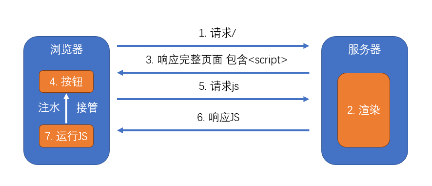

# 从零开始搭建工程

## CSR VS SSR

查看 1-1.课件.md

## 搭建 express 工程

github 上建立一个目录->克隆到本地->初始化->安装 express->进行服务器搭建 server.js

1. 搭建 express 服务器，对所有 get 请求均响应一个页面
2. 配置`package.json`，更加方便的启动服务器
3. 安装`nodemon`，监控文件的变化

## 服务端渲染组件

新建 pages 文件夹(服务端、客户端共用)->用 React 框架->安装 react、react-dom->node 环境识别不了 import 引入的文件(require 方式可以)->安装 webpack、webpack-cli 进行编译打包转化成虚拟节点(写 webpack 配制 mode、devtool、entry)->webpack 识别不了 jsx 后缀文件->安装 babel(@babel/core babel-loader @babel/preset-react) 进行转义->webpack 配制 module 部分、target、resolve、externals、output->server.js 里设置图标、渲染 componentHTML 的 jsx 文档->package.json 的 script 用 npm-run-all 并配制一下->把 server.js 重新分配一下到 server 文件夹(app.jsx、index.js、render.js),再删除 server.js->重新打包执行一次

`备注`

1. 服务器书写`react`组件
2. 使用`webpack`打包**服务器代码**到`dist`目录
3. 利用`@babel/preset-react`解析`react`代码
4. 利用`externals`配置和`webpack-node-externals`排除掉`node_modules`目录
5. 重新配置`package.json`
6. 渲染页面组件的内容到`div`中

## 客户端渲染组件

在 src 下建立客户端 client->修改 package.json 的 script 配制->配制 webpack.client.js->建立 webpack.base.js 配制提取 webpack.client.js 与 webpack.server.js 共同配制->安装 webpack-merge 合并 webpack.client.js 与 webpack.server.js-安装 clean-webpack-plugin 并配制,对在打包前将之前打包的文件清理掉->在 server 下新建 getScripts.js 设置获得 client 动态打包后的 js 文件更新->引入到服务端 server 下的 render.js 进行设置->打包后再次运行,这样 pages 文件夹下的任何文件发生改变,这里都会自动更新

`备注`

本节课目标：在客户端渲染 React 组件
同构：保持服务器和客户端渲染一致

1. 书写客户端启动文件
2. 使用`webpack`打包**客户端代码**到`public`目录
3. 在服务器输出的`html`代码中引入`js`
4. 重新配置`package.json`

## 引入样式

安装 mini-css-extract-plugin css-loader->全局样式 src 下新建 assets 文件夹,文件 global.css->将 global 引入到 client->Home 下设置局部样式 index.css->在 webpack.client.js 设置 plugins、module 打包解析的 css(MiniCssExtractPlugin)->webpack.client.js 的 module 开启 modules->在 server 下新建 getLinks.js 设置获得 client 动态打包后的 css 文件更新->引入到服务端 server 下的 render.js 进行设置->在 webpack.server.js 设置 module 并开启 modules(server 只要生成 hash 值的 css[isomorphic-style-loader]就可以)->打包后再次运行,这样 pages 文件夹下的任何文件发生改变,这里都会自动更新

`备注`

1. 利用 webpack 生成样式文件
   客户端具有完整的样式依赖，经过`mini-css-extract-plugin`进行打包，生成样式
   服务端可以没有完整的样式依赖，但是，必须保证生成的代码中，类样式和客户端保持一致
2. 在页面源代码中加入一个 link 元素，链接到样式文件

## 引入图片

安装 file-loader->在 webpack.client.js 与 webpack.server.js 里配制 rules->在 webpack.client.js 与 webpack.server.js 都配制输出路径 output(publicPath:"/")->打包后再次运行,这样 pages 文件夹下的任何文件发生改变,这里都会自动更新

`备注`

1. 客户端负责生成文件
2. 服务器保证图片路径一致

## 使用路由

新建 client、server 公共文件 Movies、NotFound->安装 react-router-dom->新建 client、server 公用 routes 文件->把 RouteApp 引入到 client、server 里,client 用 BrowerRouter、server 用 StaticRouter(这里要设置 location 与 context)、server 里的 render 也要做相应的设置->把 render.js 里的 html 部分提出去(getHtml.js)->新建 components 下的 Header 做导航->引入到 routes 下的 RouteApp 让其游动起来->再次运行,这样 pages 文件夹下的任何文件发生改变,这里都会自动更新

## 使用路由配置

在 routes 下新建 routeConfig 将 RouteApp 里的路由提取成一个公共的路由配置(手动配置)->安装 react-router-config 处理路由配置,在 RouteApp 里引入->再次运行,这样 pages 文件夹下的任何文件发生改变,这里都会自动更新

## 多级路由

在 pages 下新建显示前台页面 Front.jsx、后台页面 Admin->Admin 下新建后台页面的用户管理 UserManage、系统管理 SystemManage、找不到页面 NotFound、后台管理首页 Home->修改路由配置 routes 下的 routeConfig->安装 react-router-config->在 routes 下的 RouteApp 里引入它进行路由、前台页面 Front.jsx 也引入它进行路由、后台页面 Admin 下的 index.jsx 还是引入它进行路由->再次运行,这样 pages 文件夹下的任何文件发生改变,这里都会自动更新

## 使用 redux

安装 redux、react-redux->src 下新建仓库 store(actions 创建函数、reducers)->在 server 下的 App.jsx 引入 store 用 react-redux 的 Provider 渲染出来->在 client 下的 App.jsx 引入 store 用 react-redux 的 Provider 渲染出来->在 client、server 公用的 pages 下的 Home 传入 store->再次运行,这样 pages 文件夹下的任何文件发生改变,这里都会自动更新

## 数据通信

副作用处理->安装 redux-thunk、axios->src 下新建 services 处理副作用->测试 client、server 请求数据->client 请示不到,需要把 server 数据转发到 client 再去请求->用第三方库 http-proxy-middleware->在 server 下的 index.js 引入这个库,再次运行 client 就获取到数据了->在 store 下的 action 下的 movies.js 利用 redux-thunk 处理副作用,请求数据->store 下的 index.js 利用 Redux Devtools,redux 下的 applymiddleware、compose、thunk 处理 client、server->再次运行,client 在 Redux DevTools 下就有数据了

## 服务端数据加载

用仓库的数据把电影列表加载出来->pages 下的 Movies(函数组件用 hook 异步请求数据,但是服务端 server 不运行)->在 server(render) 加载数据前把数据加载到仓库(pages 下的 Movies 写一个静态方法 loadData 从仓库加载数据)->用匹配路由的方式进行异步加载(server 下新建 loadData 函数进行加载、将其设置在 server 下的 getHtml.js 里进行服务端渲染、到 store 的 index.js 下的客户端添加它,让客户端与服务端保持一致)->为了在请求数据时,只有在 movies 时才让数据在服务端与客户端保持一致,在 server 下的 getHtml.js 设置 window.requestPath,在 client 下的 index.jsx 下的只能在客户端加载的 useEffect 里设置路径->再次运行,这样数据只有在需要加载数据的页面才会加载

## 服务端仓库共享问题

仓库数据有缓存,不管请示哪个页面都是一样的数据,需要做一下处理->store 做一下处理,让每次都返回一个新的 store->client(App.jsx 里修改一下 store)、server 都需要修改一下 store(服务器的仓库应该从 render.js 里来,然后在 App.jsx、loadData.js、getHtml.js 用到的 store 都用传值的形式传过来)->再次运行,每次请求的都是新的仓库

## staticContext

`某个组件需要给某个处理函数发出通知就可以利用 context`
服务器端的 context->pages 下的 NotFound 组件 设置了,在服务端渲染 render.js 设置,客户端在访问这个页面时,服务端会给客户端返回一个 404 的状态码 Status Code->在 routes 下设置一个临时页面(组件 Redirect),render.js 设置后,可以进行重定向(客户端重定向、服务端设置了重定向码 301,在客户重定向后,服务端给客户端会返回一个 301 的状态码 Status Code)

# nextjs(框架支持 SSR 还有 umijs)

## 搭建 SSR 工程

官网：https://nextjs.org/
民间中文网：https://nextjs.frontendx.cn/
